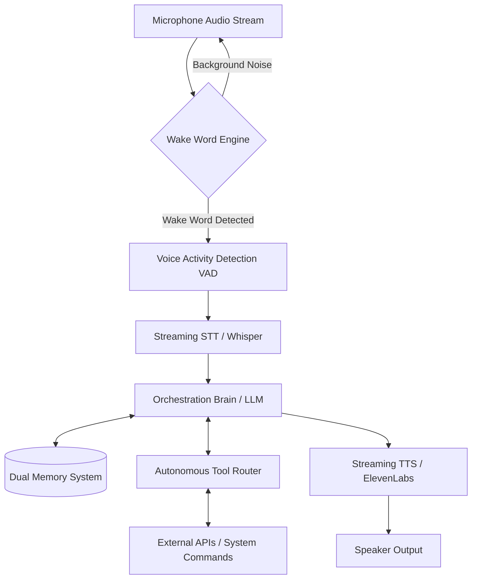

# JARVIS Voice Assistant: Comprehensive Architecture Blueprint

> [!IMPORTANT] 
> This blueprint outlines a production-grade, highly robust Python architecture for an autonomous voice assistant. It addresses critical failure points: ambient noise triggering, API rate limits, amnesia, and brittle hardcoded commands.

## 1. System Architecture Overview

The assistant operates on an **Event-Driven, Modular Pipeline** to ensure low latency and high reliability. The architecture avoids linear blocking scripts in favor of asynchronous micro-services.

## 2. Wake Word Implementation (Avoiding Background Noise)

A critical flaw in naive voice assistants is constant listening. The solution is a **local, lightweight Wake Word Engine**.

### Recommended Engines:
1. **Porcupine (Picovoice):** 
   - *Pros:* Commercial-grade accuracy, extremely low false-positive rate, lightweight.
   - *Cons:* Requires a free-tier API key and periodic renewal.
2. **OpenWakeWord:** 
   - *Pros:* Fully open-source, no API keys, runs locally via ONNX.
   - *Cons:* Slightly higher resource usage, may require tuning to reduce false positives.

**Best Practice Implementation:**
Run the Wake Word engine on a dedicated background thread reading small audio chunks (e.g., 512 frames). Only when the trigger (e.g., "Hey JARVIS") is detected does the system activate **Voice Activity Detection (VAD)** (e.g., Silero VAD) to record the actual command until silence is detected.

## 3. Handling API Rate Limits (Error 429) Gracefully

Hard crashing on `Error 429: Too Many Requests` is unacceptable for an independent AI. 

> [!TIP]
> Never use standard `time.sleep()` for rate limits. Use the **Tenacity** Python library for intelligent backoff.

**Implementation Strategy:**
- **Exponential Backoff with Jitter:** Double the wait time after each failure, but add randomness (jitter) to prevent a "thundering herd" of retries.
- **Respect Retry-After Headers:** If an API provides a `Retry-After` header, parse it and wait exactly that long.
- **Graceful Fallbacks:** If the primary LLM (e.g., OpenAI) fails after max retries, automatically failover to a local model (e.g., Ollama running Llama-3).

## 4. Persistent Memory (Ending AI Amnesia)

To make JARVIS truly independent, it needs persistent state across reboots. This requires a **Dual-Memory Architecture**.

1. **Structured State Memory (SQLite):**
   - Stores user preferences, system settings, and tabular conversation logs. Acts as the deterministic "source of truth."
2. **Semantic Long-Term Memory (ChromaDB):**
   - Stores vector embeddings of past conversations and acquired knowledge. Enables RAG (Retrieval-Augmented Generation) so the AI can recall past context via similarity search.

**Workflow:** When a query is received, the AI performs a hybrid search: retrieving state from SQLite and semantic context from ChromaDB before generating a response.

## 5. Autonomous Tool Calling (Replacing Hardcoded Strings)

Legacy assistants rely on brittle if-else string matching. A robust JARVIS uses **LLM Function Calling**.

> [!WARNING]
> Never let an LLM execute raw shell commands directly. Always use predefined tools with strict Pydantic schemas acting as guardrails.

**Implementation via the ReAct (Reason + Act) Loop:**
1. **Define Tools:** Create distinct Python functions with type hints and docstrings (e.g., `get_weather(location: str)`).
2. **Schema Binding:** Expose these functions to the LLM via OpenAI's function calling API or a framework like LangChain.
3. **Autonomous Routing:** The LLM receives the prompt and decides *which* tool to call, extracting exact parameters.
4. **Execution & Feedback:** The Python backend executes the tool safely and feeds the result back to the LLM for a natural language response.
